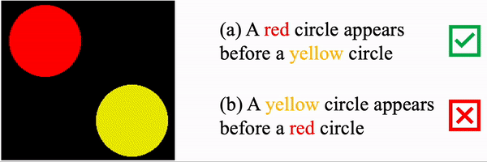
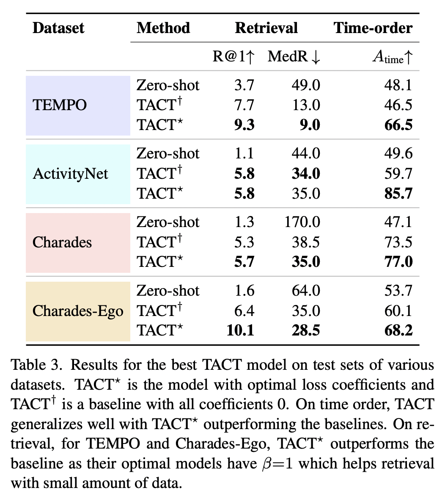
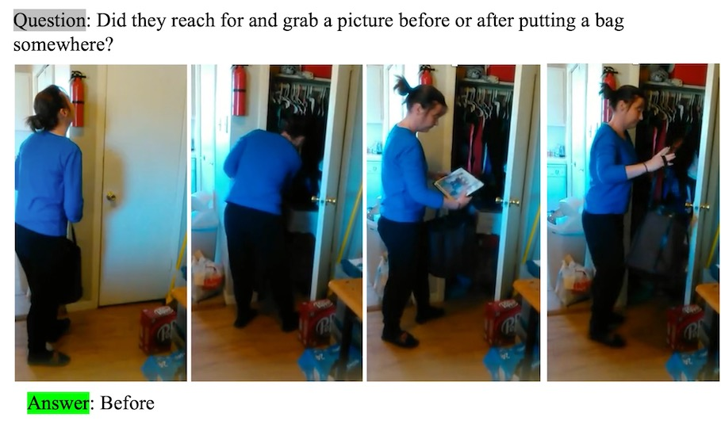
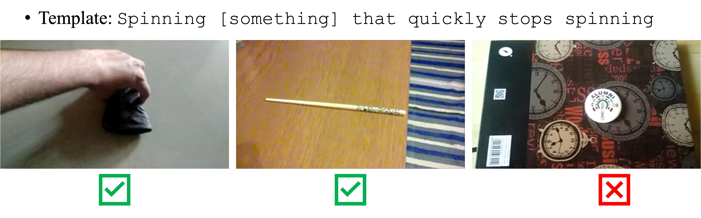
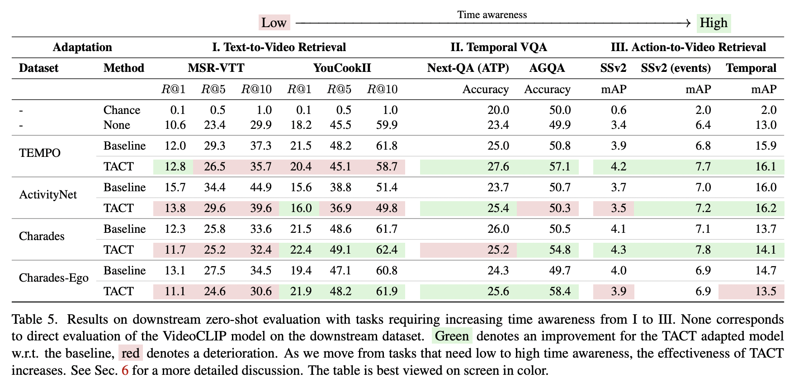

##  ⏰ [Test of Time: Instilling Video-Language Models with a Sense of Time](https://arxiv.org/abs/2301.02074)

Code for our CVPR 2023 [paper](https://arxiv.org/abs/2301.02074) on instilling a sense of time in video-language models.

<p align="center">
    <a href="https://bpiyush.github.io/testoftime-website/">[Project Page]</a> &nbsp; | &nbsp;
    <a href="https://arxiv.org/abs/2301.02074">[Arxiv]</a> &nbsp; | &nbsp;
    <a href="#📚-datasets">[Data]</a> &nbsp; | &nbsp;
    <a href="https://github.com/bpiyush/TestOfTime"> [Code]</a> &nbsp; | &nbsp;
    <a href="#"> [Video] (⌛)</a> &nbsp; | &nbsp;
    <a href="#"> [CVPR 2023 Poster] (⌛)</a>
<p>

<p align="center">

</p>


## Table of Contents

* [Brief Overview](#🔭-brief-overview)
* [Updates](#-updates)
* [Installation & Setup](#-installation--setup)
* [Datasets](#-datasets)
* [Models](#🤖-models)
* [Post-pretraining: TACT](#-post-pretraining-tact)
* [Evaluation: TACT](#-evaluation-tact)
* [Evaluation: Downstream Tasks](#-evaluation-downstream-tasks)
* [Citation](#-citation)
* [Acknowledgements](#-acknowledgements)


## 🔭 Brief Overview

* We show that existing video-language models struggle to associate time order in video and language through a controlled experiment on [synthetic data](#synthetic-data).
* Based on [VideoCLIP](https://arxiv.org/abs/2109.14084), we propose TACT (<u>T</u>emporal <u>A</u>daptation by <u>C</u>onsistent <u>T</u>ime-ordering), a method for temporal adaptation
using this time order consistency without having to pretrain from scratch.
* We demonstrate improved zeroshot generalizability of our temporally adapted models on tasks that require higher time awareness.


## 📅 Updates

* 24th March 2023: Code released.


## 🚀 Installation & Setup

Create a `conda` environment and install packages as described in [`setup/env.md`](setup/env.md). We recommend running `python setup/check_packages.py` to check if all packages are installed correctly.


## 📚 Datasets

We use a combination of synthetic and real datasets to evaluate our approach. Below, you can find instructions to download and prepare the datasets. Here, we present instructions for our Synthetic dataset and the [TEMPO-TL](https://arxiv.org/abs/1809.01337v1) dataset.

For each dataset, we provide a `.zip` file that contains (i) train-test splits, (ii) S3D features for video (at 1 FPS) that serve as input to VideoCLIP model. Use the following to download all datasets:

```sh
bash setup/download_datasets.sh /path/to/datasets/
```
Pass the path to folder where you want to store the datasets (e.g., `./all_data/`).


### Synthetic data

We create simple synthetic video-language pairs by stitching together a pair of events (e.g., "a <span style="color:red">red</span> circle appears" and "a <span style="color:yellow">yellow</span> circle appears") with text description connected by *before/after* relations. An example is shown here:

<!--  -->
<p align="center">

</p>


### TEMPO-TL dataset

As a real dataset, we consider the [TEMPO-TL](https://arxiv.org/abs/1809.01337v1) dataset that similarly stitches together a pair of events in text for clips in the same video.

<!--  -->
<p align="center">

</p>


**New datasets**: In order to evaluate our approach on other (new) datasets, you need to first generate and save S3D video features. See [this](https://github.com/facebookresearch/fairseq/tree/main/examples/MMPT/scripts/video_feature_extractor) for an open-source feature extractor. Then, create splits, create a dataset object in `package/datasets/`. Please see `package/datasets/tempo.py` for reference.

## 🤖 Models

We base our experiments on the VideoCLIP model from FAIR. Instructions in [`setup/env.md`](setup/env.md) include download of relevant checkpoints for VideoCLIP.

**Checkpoint zoo**: Here, we provide checkpoints for TACT adapted VideoCLIP models post-pretrained on (i) TEMPO-TL, (ii) ActivityNet, (iii) Charades, (iv) Charades-Ego.

| **Post-pretraining Dataset** 	|                        	|   **Hyperparameters**   	|         	| **Download link** 	|
|------------------------------	|:----------------------:	|:-----------------------:	|:-------:	|:-----------------:	|
|                              	| $\alpha_{\text{same}}$ 	| $\alpha_{\text{cross}}$ 	| $\beta$ 	|                   	|
| TEMPO-TL                     	|           1.0          	|           1.0           	|   1.0   	|        [Link](https://isis-data.science.uva.nl/testoftime/checkpoints/tempo-hparams_1.0_1.0_1.0-epoch=27-step=8288.ckpt)       	|
| ActivityNet                  	|           1.0          	|           1.0           	|   0.0   	|        [Link](https://isis-data.science.uva.nl/testoftime/checkpoints/activitynet-hparams_1.0_1.0_0.0-epoch%3D9-step%3D7450.ckpt)       	|
| Charades                     	|           1.0          	|           1.0           	|   0.0   	|        [Link](https://isis-data.science.uva.nl/testoftime/checkpoints/charades-hparams_1.0_1.0_0.0-epoch%3D3-step%3D3120.ckpt)       	|
| Charades-Ego                 	|           1.0          	|           1.0           	|   1.0   	|        [Link](https://isis-data.science.uva.nl/testoftime/checkpoints/charadesego-hparams_1.0_1.0_1.0-epoch%3D2-step%3D3639.ckpt)       	|

To download all checkpoints in one go, run:

```sh
bash setup/download_checkpoints.sh /path/to/checkpoints/
```
Pass the path to folder where you want to store the checkpoints (e.g., `./all_checkpoints/`).

## 🏋️‍♀️ Post-pretraining: TACT

* Post-pretraining on TEMPO-TL dataset
    ```sh
    python postpretrain.py --dataset tempo --eval_subset temporal_1k --no_wandb --data_root /ssd/pbagad/datasets/ --only_train
    ```
    Replace `--data_root` with the path to where all your dataseta are stored. Make sure to change `entity` and `project` arguments in [`postpretrain.py`](postpretrain.py) to log to your own wandb account.

## 📊 Evaluation: TACT

#### Evaluate on `TEMPO` dataset

* Pre-trained VideoCLIP
    ```sh
    python postpretrain.py --dataset tempo --eval_subset temporal_1k --eval_split test --only_eval --no_wandb --data_root /ssd/pbagad/datasets/
    ```
    Replace `--data_root` with the path to where all your dataseta are stored. This should yield about 52% accuracy.

* TACT post-pretrained VideoCLIP
    ```sh
    ckpt=/path/to/tact/checkpoint/trained/on/TEMPO/
    # For example, ckpt=./all_checkpoints/tempo-hparams_1.0_1.0_1.0-epoch=27-step=8288.ckpt
    python postpretrain.py --dataset tempo --eval_subset temporal_1k --eval_split test --only_eval --no_wandb --data_root /ssd/pbagad/datasets/ -c $ckpt
    ```
    Replace `--data_root` with the path to where all your dataseta are stored. This should yield about 66% accuracy.


The detailed results on more datasets are provided in the paper and also shown below.
<p align="center">

</p>

#### Evaluate on `Synthetic` dataset

* Pre-trained VideoCLIP
    ```sh
    python postpretrain.py --dataset synthetic --eval_subset v2.0 --eval_split test --only_eval --no_wandb --data_root /ssd/pbagad/datasets/
    ```
    Replace `--data_root` with the path to where all your dataseta are stored. This should yield about 45% accuracy.

* TACT post-pretrained VideoCLIP
    ```sh
    ckpt=/path/to/tact/checkpoint/trained/on/TEMPO/
    # For example, ckpt=./all_checkpoints/tempo-hparams_1.0_1.0_1.0-epoch=27-step=8288.ckpt
    python postpretrain.py --dataset synthetic --eval_subset v2.0 --eval_split test --only_eval --no_wandb --data_root /ssd/pbagad/datasets/ -c $ckpt
    ```
    Replace `--data_root` with the path to where all your dataseta are stored. This should yield about 78% accuracy.


## 📊 Evaluation: Downstream Tasks


To illustrate zero-shot performance of our TACT adapted model on a downstream task, we provide code to run the following evaluations.

### Video Question Answering on `AGQA`

Here, we evaluate `VideoQA` on a subset of the [`AGQA` dataset](https://ai.stanford.edu/blog/agqa/).

An example instance from the `AGQA` dataset is shown below:
<!--  -->
<p align="center">

</p>


Note that, to run this, you need the pre-computed S3D features for the AGQA dataset.

* Pre-trained VideoCLIP
    ```sh
    python downstream_zeroshot.py --data_root /ssd/pbagad/datasets/ --dataset agqa --task videoqa --no_save
    ```
    Replace `--data_root` with the path to where all your dataseta are stored. This should yield about 49.9% accuracy.

* TACT post-pretrained VideoCLIP
    ```sh
    ckpt=/path/to/tact/checkpoint/trained/on/TEMPO/
    # For example, ckpt=./all_checkpoints/tempo-hparams_1.0_1.0_1.0-epoch=27-step=8288.ckpt
    python downstream_zeroshot.py --data_root /ssd/pbagad/datasets/ --dataset agqa --task videoqa --no_save -c $ckpt
    ```
    Replace `--data_root` with the path to where all your dataseta are stored. This should yield about 57.1% accuracy.

### Action Retrieval on `SSv2`

Here, we evaluate `Action Retrieval` on a subset of the [`SSv2` dataset](https://developer.qualcomm.com/software/ai-datasets/something-something).

An example instance from the `SSv2` dataset is shown below:
<p align="center">

</p>

Note that, to run this, you need the pre-computed S3D features for the SSv2 dataset.

* Pre-trained VideoCLIP
    ```sh
    python downstream_zeroshot.py --data_root /ssd/pbagad/datasets/ --dataset ssv2 --task action_retrieval --no_save --split "validation-tmpl-ret-singularity"
    ```
    Replace `--data_root` with the path to where all your dataseta are stored. This should yield about 3.4% mAP (`metric_t2v_mAP`).

* TACT post-pretrained VideoCLIP
    ```sh
    ckpt=/path/to/tact/checkpoint/trained/on/TEMPO/
    # For example, ckpt=./all_checkpoints/tempo-hparams_1.0_1.0_1.0-epoch=27-step=8288.ckpt
    python downstream_zeroshot.py --data_root /ssd/pbagad/datasets/ --dataset ssv2 --task action_retrieval  --no_save --split "validation-tmpl-ret-singularity" -c $ckpt 
    ```
    Replace `--data_root` with the path to where all your dataseta are stored. This should yield about 4.2% mAP (`metric_t2v_mAP`).


The detailed results on more datasets/tasks are provided in the paper and also shown below.
<p align="center">

</p>

## 📖 Citation

If you found our work useful or relevant, please consider citing our paper:

```bibtex
@inproceedings{
      bagad2023testoftime,
      title={{T}est of {T}ime: {I}nstilling {V}ideo-{L}anguage {M}odels with a {S}ense of {T}ime},
      author={Bagad, Piyush and Tapaswi, Makarand and Snoek, Cees G. M.},
      booktitle={CVPR},
      year={2023}
}
```

## 🙏 Acknowledgements

- We acknowledge support from the [ELLIS Amsterdam Unit](https://ivi.fnwi.uva.nl/ellis/) and the [AMS Scholarhsip](https://www.uva.nl/en/education/fees-and-funding/masters-scholarships-and-loans/faculty-scholarships-science/science.html) to Piyush as a Master's student.
- We also thank [Dr. Dennis Koelma](https://staff.fnwi.uva.nl/d.c.koelma/) for regular help with compute infrastructure and hosting of data and models.
- We also acknowledge all relevent prior work, particularly, [VideoCLIP](https://arxiv.org/abs/2109.14084) and [TEMPO](https://arxiv.org/abs/1809.01337v1), for making their code and data publicly available.

### Additional Notes

> :warning: **Infra note**: Our code has been run on a single node with 4 GPUs (either NVIDIA RTX A5000 or NVIDIA GeForce 1080). Running it on different infrastructures may cause differences in results. However, the trends and inferences should be similar (e.g., post-pretraining helps with temporal ordering task, etc.).

> 💡: If you have any issues or suggestions, feel free to open an issue or contact us via email.

### Closely Related Work

Please also consider looking at the following related papers:

* Wu et al, [Audio-Text Models Do Not Yet Leverage Natural Language](https://arxiv.org/abs/2303.10667). Like us, they too check if models capture event ordering, albeit for audio-text models.
